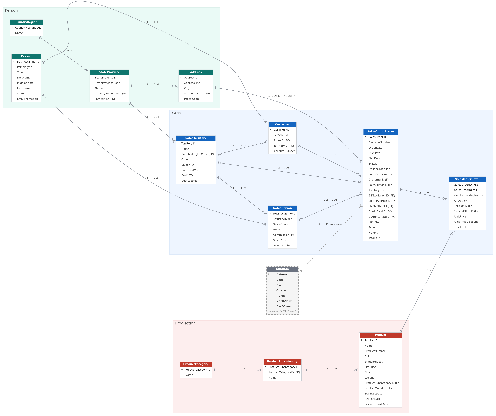
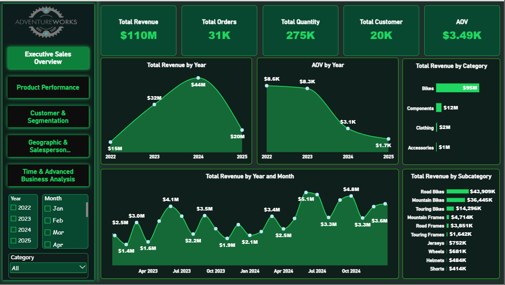
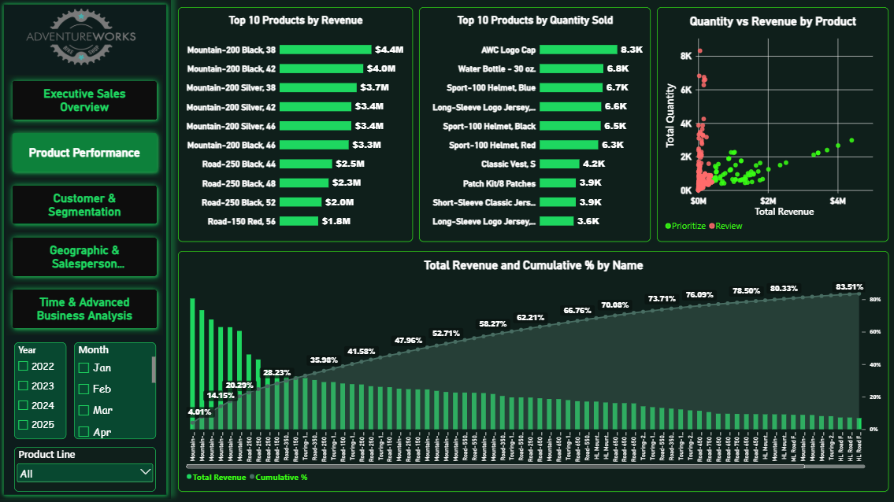
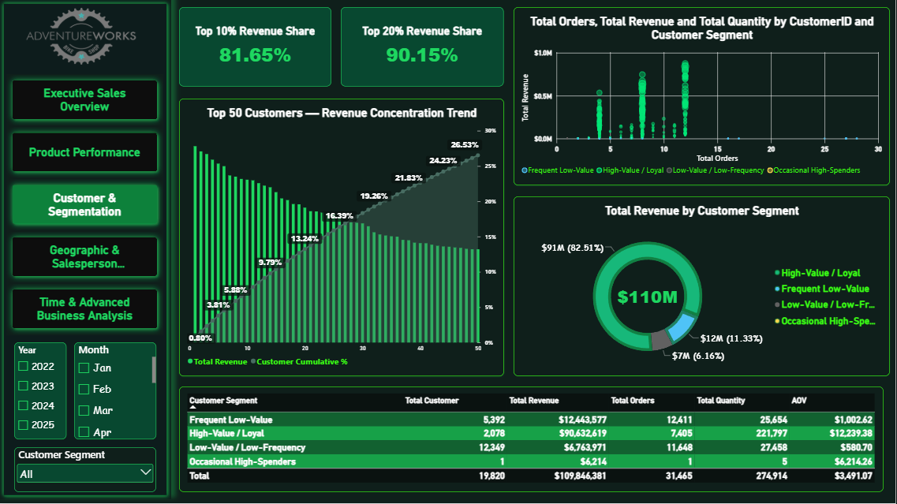
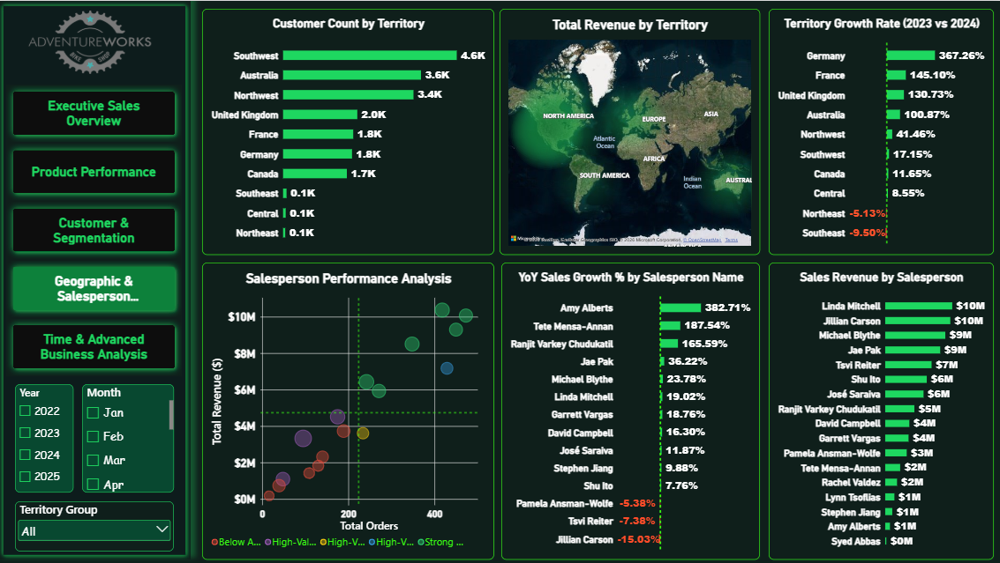
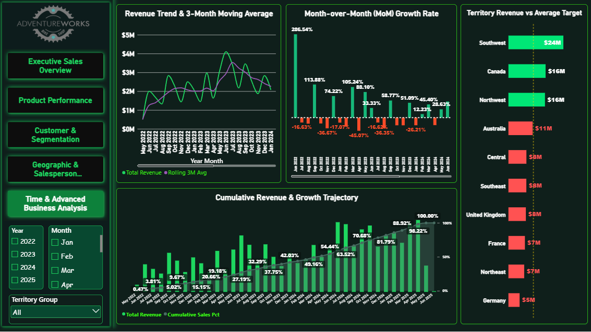

# 🚀 AdventureWorks Sales & Advanced Analytics

## From Raw Data to Business Insights

An end-to-end Business Intelligence & Advanced Analytics project built using the **AdventureWorks** dataset.

This project combines **SQL Server, Power BI, DAX, Data Modeling, Customer Segmentation, Product Analysis, Geographic Analysis, Salesperson Performance, and Advanced Time-Based Analytics** to transform raw transactional data into meaningful business insights.

The project follows a complete analytical workflow:

**Ask → Analyze → Validate → Visualize → Communicate**

---

# 📌 Project Overview

The objective of this project was not simply to build a Power BI dashboard.

The goal was to understand the underlying business questions, analyze the data independently using SQL, validate the results, translate the analysis into Power BI, and communicate the findings through a technical report and management presentation.

## 🧩 Data Model & Schema

Before starting the analysis, I mapped and reviewed the relationships across the main AdventureWorks data domains, including **Person, Sales, and Production**.

This data model provided the foundation for the analysis by clarifying how customers, territories, salespeople, orders, products, and geographical entities are connected.

It also helped ensure that SQL joins and Power BI relationships were built on the correct keys and business relationships.

### AdventureWorks Sales & Production Schema



The project was developed across two main analytical stages:

### 1. SQL Analysis

SQL Server was used as the primary analytical layer to:

* Explore and validate the dataset
* Calculate core business KPIs
* Analyze sales trends and growth
* Perform customer segmentation
* Analyze product contribution
* Evaluate geographic performance
* Analyze salesperson performance
* Apply window functions and advanced analytical techniques
* Validate calculations before transferring them into Power BI

### 2. Power BI Analytics

The validated SQL analysis was then translated into an interactive Power BI solution using:

* Data Modeling
* DAX Measures
* Time Intelligence
* Moving Averages
* Pareto Analysis
* Interactive Filters
* KPI Cards
* Executive Visualizations
* Dark-theme UI/UX

---

# 📊 Power BI Dashboard

The final Power BI report consists of **5 analytical pages**, each designed around a specific business perspective.

## 1️⃣ Executive Sales Overview

A high-level view of overall sales performance and the most important executive KPIs.

### Key Areas

* Total Revenue
* Total Orders
* Total Quantity
* Total Customers
* Sales Trends
* Overall Performance

### Dashboard Preview



---

## 2️⃣ Product Performance & Pareto Share

Analyzes product and category contribution to overall revenue.

### Key Areas

* Product Category Performance
* Revenue Contribution
* Product Ranking
* Pareto Analysis
* Revenue Concentration
* Top-performing Products

### Dashboard Preview



---

## 3️⃣ Customer Analytics & Value Segmentation

Analyzes customer behavior using purchasing frequency and monetary value.

### Key Areas

* Customer Revenue
* Order Frequency
* Average Order Value
* Customer Segmentation
* High-Value Customers
* Revenue Concentration
* Customer Contribution

### Dashboard Preview



---

## 4️⃣ Geographic & Salesperson Performance

Evaluates performance across territories and sales representatives.

### Key Areas

* Territory Revenue
* Customer Distribution
* Average Order Value by Territory
* Territory Growth
* Salesperson Performance
* Sales Contribution
* Geographic Performance Comparison

### Dashboard Preview



---

## 5️⃣ Temporal & Advanced Analytics

Focuses on time-based analysis and advanced analytical techniques.

### Key Areas

* Monthly Sales Trends
* Year-over-Year Growth
* Month-over-Month Analysis
* Cumulative Sales
* Rolling Average
* Period Ranking
* Revenue Contribution by Period

### Dashboard Preview



---

# 💡 Key Business Insights

The analysis revealed several important patterns across the AdventureWorks dataset.

### 🚲 Product Revenue Concentration

The **Bikes** category contributes approximately **86% of total product revenue**, while **Bikes + Components account for approximately 97%**.

This highlights the significant contribution of the core product categories to overall revenue generation.

### 👥 Customer Revenue Concentration

The **top 10% of purchasing customers generated 81.65% of total revenue**.

This demonstrates a highly concentrated revenue structure and highlights the importance of understanding customer value and purchasing behavior.

### 📈 Strong Year-over-Year Growth

Sales increased from approximately **$31.6M in 2023 to $43.7M in 2024**, representing approximately **38% YoY growth**.

### 📊 Trend Analysis

Monthly sales can fluctuate significantly. A **3-month rolling average** was therefore implemented to reduce short-term volatility and provide a clearer view of the underlying revenue trend.

### 🌍 Geographic Performance

Territory-level analysis showed significant differences in revenue performance across regions.

The analysis also demonstrated that **customer count alone does not explain revenue performance**, making metrics such as Average Order Value and sales growth important when evaluating geographic performance.

---

# 🧠 Customer Segmentation

Customers were analyzed using a behavioral segmentation approach based primarily on:

* **Frequency** → Number of Orders
* **Monetary Value** → Total Sales

Supporting metrics included:

* Average Order Value
* Total Quantity Purchased

This approach allowed customers to be grouped according to purchasing behavior rather than relying only on total revenue.

---

# 🧮 Advanced SQL Analysis

The SQL layer includes a range of analytical techniques, including:

* CTEs
* Multi-table JOINs
* Aggregations
* CASE statements
* Window Functions
* `LAG()`
* Ranking
* Cumulative calculations
* Growth Rate calculations
* Customer-level aggregation
* Segmentation logic
* Time-based analysis
* Pareto-style contribution analysis

The SQL analysis was used as the analytical foundation and validation layer for the Power BI report.

---

# 🔄 SQL → Power BI Validation

One of the most important parts of the project was validating the Power BI results against the SQL analysis.

The workflow was:

**SQL Analysis**

↓

**Validate Business Logic**

↓

**Build Power BI Model**

↓

**Create DAX Measures**

↓

**Cross-Validate Results**

↓

**Build Final Dashboard**

This cross-validation process helped ensure that the numbers presented in Power BI were consistent with the underlying SQL analysis.

---

# 🛠️ Tools & Technologies

### SQL Server

* SQL
* CTEs
* Window Functions
* `LAG()`
* Ranking
* Multi-Table Joins
* Aggregations
* Analytical Calculations

### Power BI & DAX

* Data Modeling
* Dynamic Measures
* Time Intelligence
* Moving Averages
* Pareto Analysis
* Interactive Filtering
* Data Visualization
* Dark Theme UI/UX

### Documentation & Communication

* Business Insights
* Technical Report
* Management Presentation
* Data Storytelling

---

# 📁 Project Structure

```text
AdventureWorks-Analytics/
│
├── 📁 01-SQL-Scripts/
│   ├── Customer Segmentation.sql
│   ├── Geographic Analysis .sql
│   ├── Overall.sql
│   ├── Salesperson Analysis.sql
│   └── Temporal View .sql
│
├── 📁 02-Dashboard-Screenshots/
│   ├── 01-Executive-Sales-Overview
│   ├── 02-Product-Performance-Pareto
│   ├── 03-Customer-Analytics-Segmentation
│   ├── 04-Geographic-Salesperson-Performance
│   └── 05-Temporal-Advanced-Analytics
│
├── 📁 03-Reports-and-Presentations/
│   ├── AdventureWorks_Business_Analysis_Report.docx
│   └── AdventureWorks_Management_Presentation
│
├── 📄 AdventureWorks_Sales_&_Advanced_Analytics_Dashboard.pbix
│
└── 📄 README.md
```

---

# 📂 SQL Analysis

The SQL scripts are organized by analytical area:

### Customer Segmentation

`Customer Segmentation.sql`

Focuses on customer-level purchasing behavior, frequency, monetary value, and segmentation.

### Geographic Analysis

`Geographic Analysis .sql`

Analyzes territory-level sales, customer distribution, Average Order Value, and geographic growth.

### Overall Analysis

`Overall.sql`

Contains the core overall sales KPIs and foundational business analysis.

### Salesperson Analysis

`Salesperson Analysis.sql`

Evaluates salesperson performance using multiple business KPIs and comparative analysis.

### Temporal Analysis

`Temporal View .sql`

Contains time-based analysis including trends, growth, cumulative metrics, rankings, and rolling averages.

---

# 📑 Reports & Presentation

### Business Analysis Report

**AdventureWorks_Business_Analysis_Report**

The technical report documents the analytical methodology, business questions, SQL analysis, findings, and business insights developed throughout the project.

### Management Presentation

**AdventureWorks_Management_Presentation**

The management presentation summarizes the project, analytical approach, key findings, and business insights in an executive-friendly format.

---

# 🎥 Project Walkthrough

A full project walkthrough is available on LinkedIn.

The video covers the complete project journey:

**Power BI Dashboards → SQL Analysis → Technical Report → Management Presentation**

🔗 **[Watch the Project Walkthrough on LinkedIn](ADD-LINK-HERE)**

---

# 📊 Power BI File

The complete interactive Power BI report is included in the repository:

**AdventureWorks_Sales_&_Advanced_Analytics_Dashboard.pbix**

The file contains the final Power BI data model, DAX measures, interactive visuals, and five analytical report pages.

> Power BI Desktop is required to open the `.pbix` file.

---

# 🎯 Project Objective

The primary objective of this project was to demonstrate an end-to-end analytical workflow:

> **Transform raw transactional data into validated analysis, interactive dashboards, and actionable business insights.**

The project demonstrates how **SQL Server and Power BI can work together as part of a complete Business Intelligence workflow**, from raw data analysis to executive communication.

---

# 👤 About Me

## Youssef Mohamed

**Data Analytics | SQL | Power BI | DAX | Business Intelligence**

🔗 [LinkedIn Profile](https://www.linkedin.com/in/youssef-mohamed-6038092b2/)

🔗 [GitHub Profile](https://github.com/youssef-mohamed004)

---

# ⭐ Explore the Project

Feel free to explore the repository to review the complete analytical workflow, including:

* SQL analysis scripts
* Power BI dashboard
* Dashboard screenshots
* Business Analysis Report
* Management Presentation
* Key business insights
* Technical methodology

**From raw data to business insights — every step of the analysis is documented in this repository.**

---

# 📌 Technologies

`SQL Server` `Power BI` `DAX` `Data Modeling` `Business Intelligence` `Data Analytics` `Data Visualization` `Advanced Analytics`
